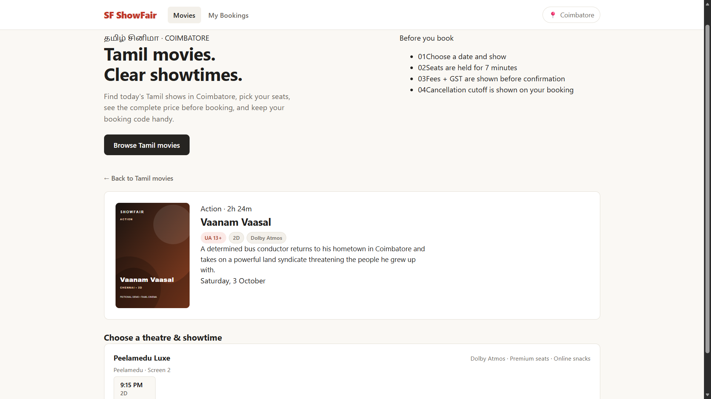
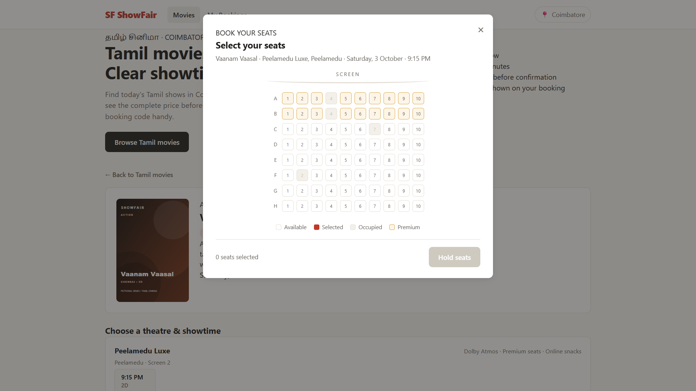

# ShowFair — Tamil Cinema 🎬

> A focused Tamil movie showtime and seat-booking demo for Coimbatore, featuring server-side seat holds, pricing, booking, cancellation, and India-time scheduling.

[](https://showfair-movieticket-booking-system.onrender.com/)
[](https://github.com/jafersathikbace-cbe/showfair-movieticket-booking-system)
[](LICENSE)

**Live Demo:** https://showfair-movieticket-booking-system.onrender.com/

---

## Application Preview

### ShowFair booking interface



*Tamil movie discovery and Coimbatore showtime selection.*

### Live seat selection



*Server-backed seat selection with premium-seat indicators, occupied seats, and temporary seat holds.*

---

## Overview

ShowFair is a focused movie showtime and ticket-booking demonstration built around a **Tamil-cinema experience for Coimbatore**.

The application allows visitors to:

- Browse Tamil movies only
- Switch between today and the next four days
- View Coimbatore theatres and showtimes
- Inspect a live 8×10 seat map
- Hold seats on the server for 7 minutes
- View ticket, convenience-fee, and GST calculations before confirmation
- Receive a booking code
- Look up bookings using an email address
- Cancel eligible bookings and view the refund amount

The movies, theatres, schedules, and poster artwork are **fictional demo content**.

---

## Key Features

### 🎬 Tamil Movie Discovery

- Tamil-only movie catalog
- Coimbatore-focused theatre and showtime experience
- Movie details including genre, duration, certification, format, and description
- Local fictional poster artwork
- Rolling demo schedule that remains populated over time

### 🎟️ Seat Booking

- Live 8×10 seat layout
- Premium seats in rows A–B
- Occupied-seat detection
- Temporary seven-minute server-side seat holds
- Seat availability rechecked before booking confirmation
- Booking code generated after confirmation

### 💰 Server-Side Pricing

The server calculates the complete booking amount before confirmation:

- Base ticket amount
- Premium-seat surcharge
- Convenience fee
- GST
- Final total

The browser displays the server-calculated result instead of independently calculating the checkout amount.

### ❌ Cancellation

- Booking lookup by email
- Cancellation eligibility based on the booking cutoff
- India Standard Time used for show and cancellation calculations
- Refund amount displayed for eligible cancellations

### 🔐 Application Security

- Baseline Content Security Policy
- Permissions-Policy headers
- Server-side validation
- Server-side seat availability checks
- Server-side price calculation
- Past-show booking prevention
- No-cache handling for local application assets

### 🧪 Testing

The project uses Node.js's built-in test runner and includes coverage for:

- Pricing and fee rounding
- Premium-seat pricing
- Seat occupancy
- Expired holds
- Booking identifiers
- India-time cancellation cutoffs
- Customer validation
- Security headers
- Static file serving
- Tamil-only catalog behavior
- Rolling show dates
- Future-date catalog selection
- Server integration behavior

---

## How It Works

```text
                    SHOWFAIR BOOKING FLOW

┌───────────────────────┐
│   Browse Tamil Movies │
└───────────┬───────────┘
            │
            ▼
┌───────────────────────┐
│ Select Date & Showtime│
└───────────┬───────────┘
            │
            ▼
┌───────────────────────┐
│   Request Seat Map    │
└───────────┬───────────┘
            │
            ▼
┌────────────────────────────────┐
│ Server checks seat availability│
│ • Seeded occupied seats        │
│ • Confirmed bookings           │
│ • Active holds                 │
└───────────────┬────────────────┘
                │
                ▼
┌────────────────────────┐
│   Select Available Seats│
└────────────┬───────────┘
             │
             ▼
┌────────────────────────────┐
│ Server creates 7-min hold  │
│ and calculates pricing     │
└────────────┬───────────────┘
             │
             ▼
┌────────────────────────────┐
│ Checkout displays server   │
│ calculated ticket breakdown│
└────────────┬───────────────┘
             │
             ▼
┌────────────────────────────┐
│ /api/book re-checks hold   │
│ and seat availability      │
└────────────┬───────────────┘
             │
             ▼
┌───────────────────────┐
│ Confirm Booking       │
│ + Generate Booking ID │
└───────────────────────┘
